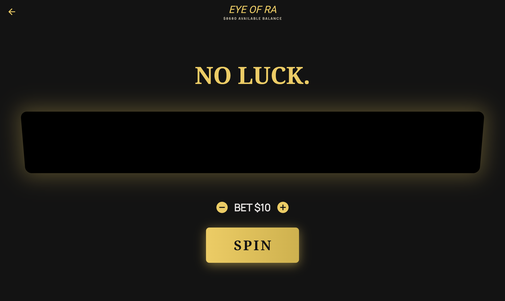

<![CDATA[<p align="center">
  
</p>

<h1 align="center">🎰 Grand Stakes Pro Simulator</h1>

<p align="center">
  <em>Una experiencia de casino de alta fidelidad, libre de riesgos, construida completamente en Flutter.</em>
</p>

<p align="center">
  
  
  
  
  
</p>

---

## 📖 Descripción

**Grand Stakes Pro Simulator** recrea la experiencia lujosa de un atelier privado de «high-roller». La aplicación ofrece una interfaz elegante con modo oscuro premium, diseño de sonido realista y gestión de estado robusta para una experiencia de juego persistente completamente local.

> ⚠️ **Disclaimer:** Este es un entorno simulado destinado únicamente a entretenimiento y demostración de portafolio. No involucra dinero real ni juego de apuestas real.

---

## ✨ Características Principales

### 🔐 Sistema de Autenticación
- Autenticación local estricta con almacenamiento persistente vía **Hive**.
- Login insensible a mayúsculas/minúsculas, compatible con email y nombre de usuario.
- Manejo multi-sesión: cada usuario posee saldo, historial de transacciones y ajustes aislados.
- **Modo Invitado** para acceso rápido y anónimo.

### 🎮 Módulos de Juego

| Juego | Descripción |
|-------|-------------|
| **♠️ Blackjack** | Lógica completa: Hit, Stand, Double Down, Split y Surrender. |
| **🎡 Ruleta** | Animaciones de giro con física realista y opciones de apuesta variadas. |
| **🎰 Slots (The Pit)** | Múltiples máquinas temáticas (*Eye of Ra*, *Nebula Gems*, *Royal Cherry*) con jackpots Minor, Major y Grand. |
| **🃏 Baccarat** | Reglas auténticas y reparto de cartas. |

### 💰 Estado Reactivo y Persistencia
- Motor de persistencia con **Hive** (`hive_flutter`) para actualización en tiempo real de saldos y estadísticas vía `ValueListenableBuilder`.
- Perfiles de jugador completos con funciones de enfriamiento (Time-out) y autenticación de dos factores simulada.
- Historial de transacciones detallado con filtros y reportes.

### 🎵 Experiencia Audio-Visual
- Banda sonora Jazz en loop continuo de fondo.
- Efectos de sonido contextuales: reparto de cartas, jackpots en slots, giro de ruleta.
- Motor de audio gestionado por `audioplayers`.
- UI premium en modo oscuro con acentos dorados (`#D4AF37`) y rubí, diseñada con constraints responsivos.

### 🌟 Extras
- **Pantalla de Splash** animada con branding de la app.
- **Sistema de Promociones** con banners dinámicos en el lobby.
- **Sección VIP** y programa de créditos.
- **Pantalla de Créditos** con información de los desarrolladores.

---

## 🏗️ Arquitectura del Proyecto

```
lib/
├── main.dart                        # Punto de entrada de la aplicación
├── theme.dart                       # Paleta de colores y temas globales (Noto Serif + Manrope)
│
├── db/
│   └── auth_service.dart            # Servicio de autenticación y almacenamiento Hive
│
├── logic/
│   └── card_deck.dart               # Lógica de baraja de cartas compartida
│
├── services/
│   └── sound_service.dart           # Servicio global de audio (música de fondo + SFX)
│
└── screens/
    ├── auth/
    │   ├── login_screen.dart        # Pantalla de inicio de sesión
    │   └── register_screen.dart     # Pantalla de registro de usuario
    │
    ├── splash_screen.dart           # Splash animado de bienvenida
    ├── main_layout.dart             # Scaffold principal con BottomNavigationBar
    ├── lobby_screen.dart            # Homepage con banners promocionales
    ├── score_screen.dart            # Dashboard reactivo de saldo
    ├── transactions_screen.dart     # Historial detallado de transacciones
    ├── config_screen.dart           # Configuración de perfil y juego responsable
    ├── promos_screen.dart           # Pantalla de promociones
    ├── vip_screen.dart              # Sección VIP
    ├── credits_screen.dart          # Créditos del equipo
    │
    ├── blackjack_screen.dart        # 🃏 Juego de Blackjack
    ├── roulette_screen.dart         # 🎡 Juego de Ruleta
    ├── slots_screen.dart            # 🎰 Selección de máquinas Slots
    ├── slot_game_screen.dart        # 🎰 Motor individual de Slot
    └── baccarat_screen.dart         # 🃏 Juego de Baccarat
```

### Assets

```
assets/images/
├── blackjack_cover.png              # Portada del juego Blackjack
├── roulette_cover.png               # Portada del juego Ruleta
├── slots_cover.png                  # Portada general de Slots
├── baccarat_cover.png               # Portada del juego Baccarat
├── eye_of_ra_slot.png               # Tema de slot: Eye of Ra
├── nebula_gems_slot.png             # Tema de slot: Nebula Gems
├── royal_cherry_slot.png            # Tema de slot: Royal Cherry
├── Jazz Music #1 (No Copyright).mp3 # Música de fondo
├── Drawing Playing Cards Sound Effect.mp3
├── Lucky wheel spin sound effect.mp3
├── Slot Machine Jackpot Sound Effect.mp3
└── gato_riendo.mp4                  # Asset de video
```

---

## 🛠️ Stack Tecnológico

| Categoría | Tecnología | Propósito |
|-----------|-----------|-----------|
| **Framework** | [Flutter](https://flutter.dev/) 3.x | UI multiplataforma |
| **Lenguaje** | [Dart](https://dart.dev/) ≥ 3.11.4 | Lógica de aplicación |
| **Base de datos local** | [Hive](https://docs.hivedb.dev/) 2.2 | Persistencia ligera y rápida en Dart puro |
| **Audio** | [Audioplayers](https://pub.dev/packages/audioplayers) 6.6 | Reproducción de música y efectos de sonido |
| **Video** | [Video Player](https://pub.dev/packages/video_player) 2.8 | Reproducción de assets de video |
| **Tipografía** | [Google Fonts](https://pub.dev/packages/google_fonts) 8.1 | Noto Serif & Manrope |
| **Internacionalización** | [intl](https://pub.dev/packages/intl) 0.20 | Formateo de fechas y números |

---

## 🚀 Comenzando

### Requisitos Previos

- **Flutter SDK** ≥ 3.x (versión estable más reciente recomendada)
- **Dart SDK** ≥ 3.11.4
- Un emulador/simulador configurado o dispositivo físico conectado
- (Opcional) Chrome para pruebas web

### Instalación

```bash
# 1. Clonar el repositorio
git clone <url-del-repositorio>
cd APP_nativa

# 2. Limpiar cache previo (opcional pero recomendado)
flutter clean

# 3. Instalar dependencias
flutter pub get
```

### Ejecución

```bash
# 📱 En dispositivo/emulador Android
flutter run

# 🍎 En simulador iOS
open -a Simulator
flutter run

# 🌐 En navegador web (Chrome)
flutter run -d chrome

# 🖥️ En macOS
flutter run -d macos
```

### Build de Producción

```bash
# APK para Android
flutter build apk --release

# App Bundle para Play Store
flutter build appbundle --release

# Web
flutter build web --release

# iOS
flutter build ios --release
```

---

## 🎨 Sistema de Diseño

La aplicación utiliza un sistema de colores cuidadosamente curado para transmitir lujo y exclusividad:

| Token | Color | Uso |
|-------|-------|-----|
| `primary` | `#F2CA50` | Acentos dorados, botones principales |
| `primaryContainer` | `#D4AF37` | Contenedores principales, oro clásico |
| `secondary` | `#FFB4AC` | Acentos rubí, alertas suaves |
| `secondaryContainer` | `#960711` | Rojo profundo para énfasis |
| `surface` | `#131313` | Fondo principal (negro profundo) |
| `surfaceContainerHigh` | `#2A2A2A` | Tarjetas y contenedores elevados |
| `tertiary` | `#BFCDFF` | Acentos azulados complementarios |

**Tipografía:**
- **Encabezados:** Noto Serif (elegante, con serifa)
- **Cuerpo:** Manrope (moderna, sin serifa, alta legibilidad)

---

## 🤝 Equipo de Desarrollo

<table>
  <tr>
    <td align="center"><strong>Daniel Gonzales Cardona</strong></td>
    <td align="center"><strong>Santiago Posso Acevedo</strong></td>
    <td align="center"><strong>Carlos Andrés Baena Moncada</strong></td>
  </tr>
</table>

---

## 📄 Licencia

Este proyecto es de uso privado y no está publicado en pub.dev. Destinado exclusivamente para fines educativos y de portafolio.

---

<p align="center">
  <sub>Hecho con ❤️ y Flutter</sub>
</p>
]]>
